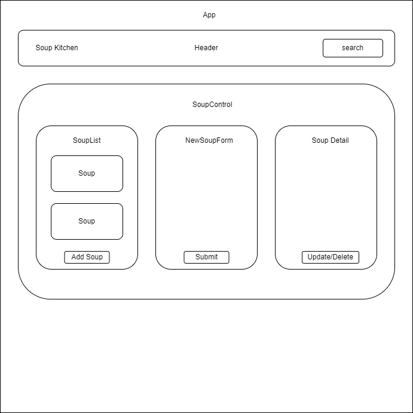

# Soup Kitchen Inventory Tracker

#### By _Winnie Wang_

#### _A simple inventory tracker_

## Technologies Used

* _HTML_
* _JavaScript_
* _React_
* _CSS_

## Description

It allows users to add and keep track of inventory at a soup kitchen. 

## Component Diagram

## Setup/Installation Requirements
_Requires console application such as Git Bash, Terminal, or PowerShell_

1. Open Git Bash or PowerShell if on Windows and Terminal if on Mac
2. Run the command

    ``git clone https://github.com/weijwang18/Inventory-Tracker.git``

3. Run the following command in the console

    ``cd Inventory-Tracker``

4. Run the following command in the console

    ``npm build``

5. Run the following command in the console

    ``npm run start``

## Known Bugs

* _No known issues_

## License

MIT

Copyright (c) 2022 Winnie Wang